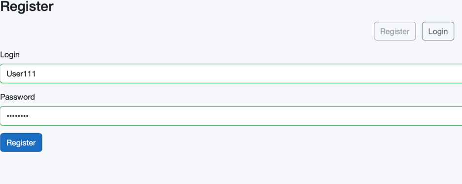

# Web Office

Система онлайн-редактирования офисных документов с интеграцией OnlyOffice через WOPI

# Docker init

## Быстрый старт для разработки
1.Клонируйте репозиторий git clone https://github.com/sisharppravi/WebOffice.git

2.скопируйте .env файл

      # MinIO
      MINIO_ROOT_USER=admin
      MINIO_ROOT_PASSWORD=admin123
      MINIO_BUCKET=weboffice-files
      
      # OnlyOffice
      ONLYOFFICE_JWT_SECRET=78YsTwvZAo646cK0BRZn2yJYps26Wx4M7sfnvzTd0nY=
      
      # Nginx 
      NGINX_PORT=80
3.Запустить backend: cd WebOffice.Api && dotnet run.

4.Запустить frontend: cd ../WebOffice.Client && dotnet run.

5.Запустите инфраструктуру (MinIO + OnlyOffice + Nginx)
docker compose up

Откройте в браузере http://localhost

Зарегистрируйте нового пользователя и войдите в систему

## Версии образов

1. MinIO: **RELEASE.2024-02-17T01-15-57Z**
2. OnlyOffie: **8.0.1**
3. Nginx: **1.27.0**

# .NET

1. MinIO: RELEASE.2024-02-17T01-15-57Z
2. OnlyOffie: 8.0.1
3. Nginx: 1.27.0

Перед началом работы выполнить команду dotnet `ef database update`

Для работы со swagger в браузере перейти на https://localhost:7130/swagger

