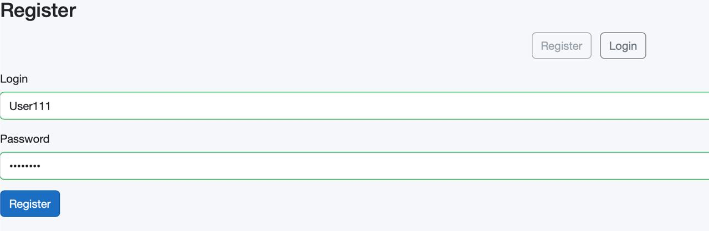
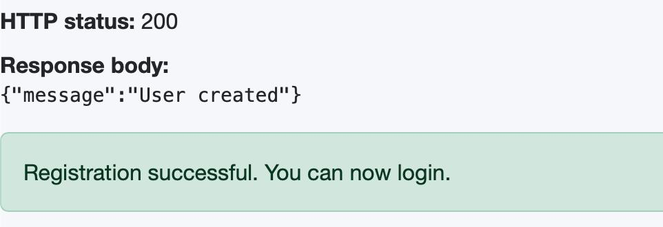
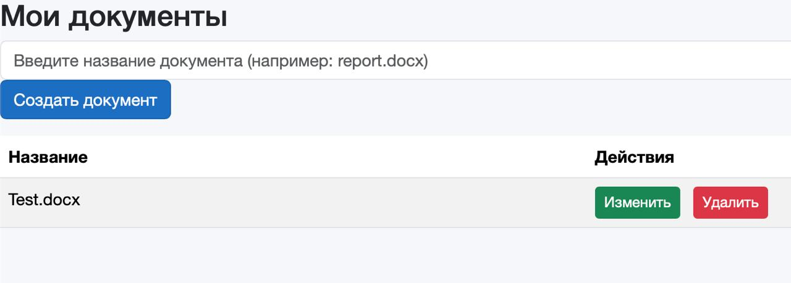

# Веб-офис

WOPI арқылы OnlyOffice интеграциясымен онлайн кеңсе құжаттарын өңдеу жүйесі

# Docker бастапқы орнату

## Дамытуға арналған жылдам бастау
1. Репозиторийді клондаңыз: git clone https://github.com/sisharppravi/WebOffice.git

2. .env файлын көшіріңіз

   # MinIO
   MINIO_ROOT_USER=admin
   MINIO_ROOT_PASSWORD=admin123
   MINIO_BUCKET=weboffice-files

   # OnlyOffice
   ONLYOFFICE_JWT_SECRET=78YsTwvZAo646cK0BRZn2yJYps26Wx4M7sfnvzTd0nY=

   # Nginx
   NGINX_PORT=80

3. Бэкендті іске қосыңыз: cd WebOffice.Api && dotnet run.

4. Frontend-ті іске қосыңыз: cd ../WebOffice.Client && dotnet run.

5. Инфрақұрылымды (MinIO + OnlyOffice + Nginx) іске қосыңыз
   docker compose up

Шолғышта http://localhost мекенжайын ашыңыз

Жаңа пайдаланушыны тіркеп, жүйеге кіріңіз

Жаңа құжат жасап, OnlyOffice-пен интеграцияның дұрыс жұмыс істеп тұрғанына көз жеткізу үшін оны өңдеңіз.

# .NET

Backend (WebOffice.Api)

| Технология                                      | Нұсқасы |
|----------------------- --------------------------|---|
| .NET / ASP.NET Core                             | 9.0 |
| Entity Framework Core                             | 9.0.14 |
| Microsoft.EntityFrameworkCore.Sqlite            | 9.0.14 |
| Microsoft.AspNetCore.Identity                   | 2.3.9 |
| Microsoft.AspNetCore.Identity.EntityFrameworkCore | 9.0.14 |
| Microsoft.AspNetCore.Authentication.JwtBearer   | 9.0.3 |
| Microsoft.IdentityModel.Tokens                  | 8.16.0 |
| System.IdentityModel.Tokens.Jwt                 | 8.16.0 |
| Microsoft.AspNetCore.OpenApi                    | 9.0.8 |
| Swashbuckle.AspNetCore (Swagger)                | 9.0.6 |
| Minio (.NET SDK)                                | 7.0.0 |

## Frontend (WebOffice.Client)

| Технология | Нұсқасы |
|---|---|
| .NET / Blazor WebAssembly | 9.0 |
| Microsoft.AspNetCore.Components.WebAssembly | 9.0.8 |

## Инфрақұрылым (Docker)

| Image | Version |
|---|---|
| MinIO | RELEASE.2024-02-17T01-15-57Z |
| OnlyOffice Document Server | 8.0.1 |
| Nginx | 1.27.0 |

Жұмысты бастамас бұрын `ef database update` dotnet командасын іске қосыңыз

Шолғымыңызда Swagger-пен жұмыс істеу үшін https://localhost:7130/swagger мекенжайына өтіңіз

Translated with DeepL.com (free version)